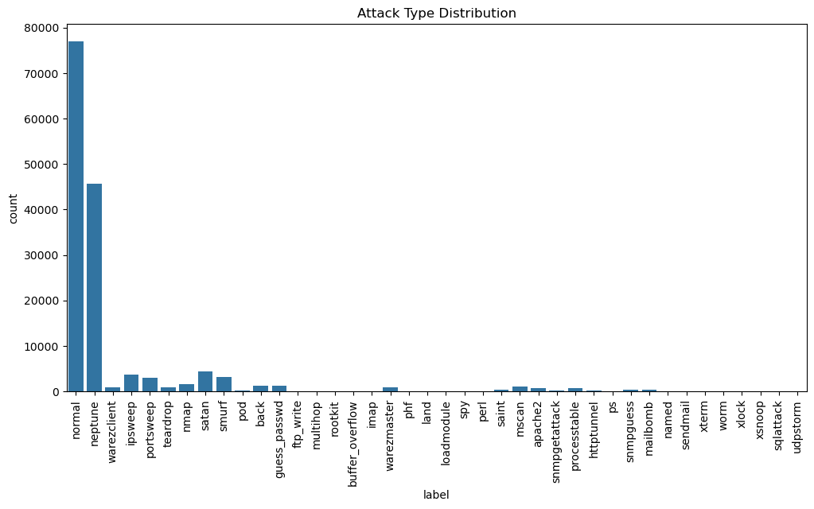
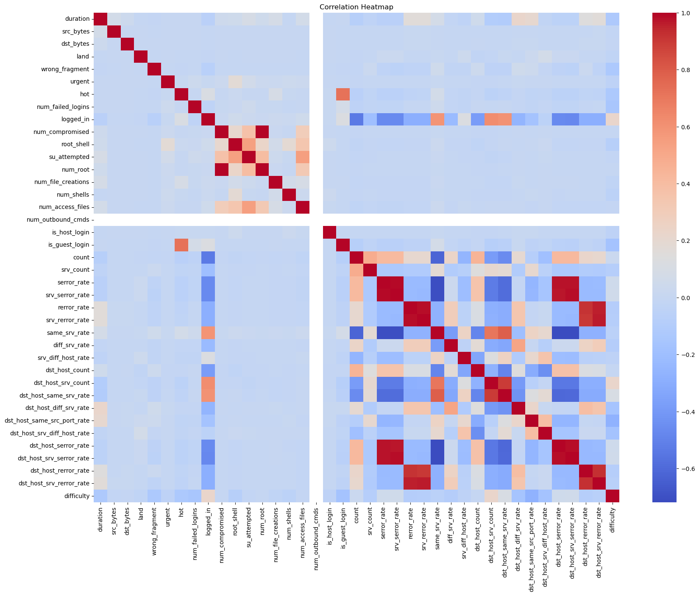
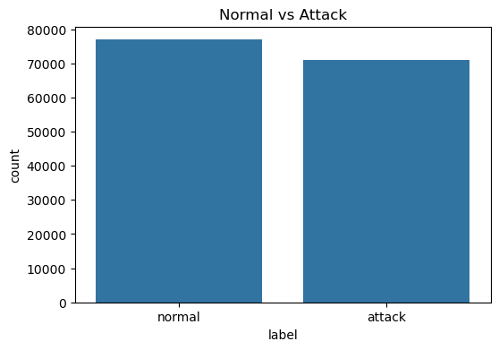
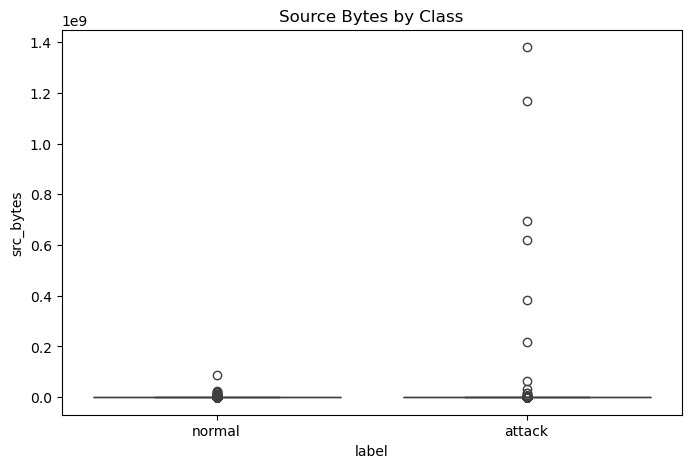
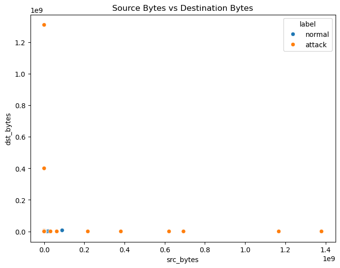
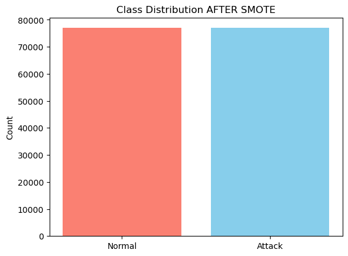
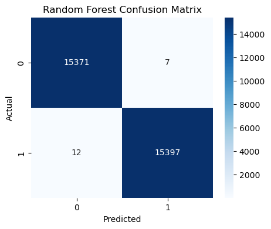

# 🛡️ Network Intrusion Detection Using Machine Learning

A comprehensive **end-to-end data mining project** for detecting network intrusions using multiple machine learning algorithms and PyCaret AutoML. This project includes complete exploratory data analysis, statistical analysis, feature engineering, model development, and comparison.

**Dataset:** NSL-KDD (Network Security Laboratory - KDD Cup)

---

## 📋 Project Overview

Network intrusion detection is a critical component of cybersecurity infrastructure. This project builds and compares multiple machine learning models to identify and classify network attacks from normal traffic patterns.

**Objective:** Binary Classification (Normal vs. Attack)

---

## 📊 Dataset Information

### Dataset Scale
- **Total Records:** 148,517 network connection records
- **Total Features:** 43 columns
- **Target Variable:** `label` (normal, neptune, back, land, etc.)
- **Difficulty Levels:** 1-20 (based on attack complexity)

### Key Features (43 Columns)

#### Network Connection Features
- `duration` - Length of connection (seconds)
- `protocol_type` - TCP, UDP, ICMP
- `service` - ftp_data, http, private, etc.
- `flag` - Connection status (SF, S0, SH, RSTR, etc.)
- `src_bytes` - Bytes sent from source
- `dst_bytes` - Bytes sent to destination

#### Content Features
- `land` - Same source and destination IP?
- `wrong_fragment` - Wrong fragments number
- `urgent` - Urgent packets
- `hot` - Number of "hot" indicators
- `num_failed_logins` - Failed login attempts
- `logged_in` - Successful login?
- `num_compromised` - Number of compromised conditions
- `root_shell` - Root shell obtained?
- `su_attempted` - su command attempted?
- `num_root` - Root access count
- `num_file_creations` - File creation operations
- `num_shells` - Shell prompts
- `num_access_files` - File access operations
- `num_outbound_cmds` - Outbound commands

#### Time-Based Features
- `count` - Connections in last 2 seconds
- `srv_count` - Service connections in last 2 seconds
- `serror_rate` - % of connections with SYN errors
- `srv_serror_rate` - % SYN errors for service
- `rerror_rate` - % of connections with REJ errors
- `srv_rerror_rate` - % REJ errors for service
- `same_srv_rate` - % connections to same service
- `diff_srv_rate` - % connections to different services

#### Host-Based Features
- `dst_host_count` - Connections to destination host
- `dst_host_srv_count` - Service connections to host
- `dst_host_same_srv_rate` - % same service to host
- `dst_host_diff_srv_rate` - % different services to host
- `dst_host_same_src_port_rate` - % same source port
- `dst_host_srv_diff_host_rate` - % connections to different hosts
- `dst_host_serror_rate` - SYN error rate to host
- `dst_host_srv_serror_rate` - SYN error rate for service
- `dst_host_rerror_rate` - REJ error rate to host
- `dst_host_srv_rerror_rate` - REJ error rate for service

---

## 🤖 Machine Learning Models

### Traditional ML Algorithms

1. **Decision Tree Classifier**
   - Interpretable tree-based model
   - Good for feature importance analysis
   - Prone to overfitting on complex datasets

2. **Random Forest Classifier**
   - Ensemble of decision trees
   - Handles non-linear relationships
   - Robust and highly accurate
   - **Key for feature importance extraction**

3. **K-Nearest Neighbors (KNN)**
   - Instance-based learning
   - k=5 neighbors configuration
   - Effective for classification tasks

4. **Logistic Regression**
   - Linear classification model
   - Fast training and prediction
   - Baseline performance benchmark

5. **Support Vector Machine (SVM)**
   - Kernel-based classification
   - Strong for high-dimensional data
   - Computationally intensive

6. **XGBoost Classifier**
   - Gradient boosting framework
   - State-of-the-art performance
   - Feature importance rankings

### AutoML Framework

**PyCaret Classification Pipeline:**
- Automatic preprocessing and feature engineering
- Feature selection and multicollinearity removal
- Automatic normalization
- Model comparison and selection
- Hyperparameter tuning
- Ensemble methods

---

## 📈 Project Workflow

### 1️⃣ Data Loading & Exploration
- Load NSL-KDD train and test datasets
- Dataset shape and structure analysis
- Data type identification
- Missing value detection

### 2️⃣ Exploratory Data Analysis (EDA)
- Univariate analysis
- Bivariate relationship analysis
- Distribution analysis
- Anomaly detection

### 3️⃣ Descriptive Statistics
- Mean, median, std deviation
- Percentile analysis
- Distribution characteristics
- Summary statistics by attack type

### 4️⃣ Inferential Statistics
- Hypothesis testing
- Correlation analysis
- Statistical significance tests
- Feature relationships

### 5️⃣ Data Visualization
- Distribution plots
- Correlation heatmaps
- Attack type distributions
- Feature importance visualizations
- Model performance comparisons

### 6️⃣ Data Preprocessing
- Handling categorical variables (LabelEncoder, OneHotEncoder)
- Missing value imputation
- Outlier detection and treatment
- Feature engineering

### 7️⃣ Feature Scaling
- StandardScaler normalization
- Min-Max scaling for specific features
- Pipeline-based transformations
- Scaling pipelines with ColumnTransformer

### 8️⃣ Model Development & Evaluation
- Train-test split (80-20)
- Model training on scaled data
- Cross-validation
- Performance metrics:
  - **Accuracy** - Overall correctness
  - **Precision** - True positive rate among predictions
  - **Recall** - True positive rate among actuals
  - **F1-Score** - Harmonic mean of precision & recall
  - **Confusion Matrix** - Detailed classification breakdown
  - **Classification Report** - Per-class metrics

### 9️⃣ Model Comparison
- Performance ranking across models
- Accuracy comparison visualization
- Metric analysis
- Best model selection

### 🔟 Feature Importance Analysis
- Random Forest feature importance
- Top 15 most important features
- Feature contribution to predictions
- Dimensionality reduction insights

### 1️⃣1️⃣ PyCaret AutoML Workflow
- Automated model setup and preprocessing
- Compare all available models
- Create and evaluate specific models
- Hyperparameter tuning
- Model ensemble creation
- Model serialization and deployment

---

## 📊 Visualizations & Analysis

### Included Visualizations

#### 1. Attack Type Distribution

- Frequency of different attack types
- Normal vs. anomalous connections
- Dataset imbalance analysis

#### 2. Feature Correlation Heatmap

- Feature interdependencies
- Multicollinearity identification
- Strong feature relationships

#### 3. Protocol Type Analysis

- TCP vs. UDP vs. ICMP traffic
- Attack distribution by protocol
- Protocol-specific vulnerabilities

#### 4. Service-Based Analysis

- Service types in dataset
- Attack concentration by service
- Service vulnerability patterns

#### 5. Byte Transfer Analysis

- Source vs. destination bytes
- Normal vs. attack traffic patterns
- Anomaly detection indicators

#### 6. Model Accuracy Comparison

- Decision Tree vs Random Forest vs KNN vs SVM vs XGBoost
- Performance ranking
- Best model identification

#### 7. Top 15 Feature Importance

- Most influential features
- Feature contribution analysis
- Dimensionality reduction guide

#### 8. Confusion Matrix (Best Model)

- True positives, false positives
- True negatives, false negatives
- Model prediction accuracy breakdown

#### 9. ROC-AUC Curves

- Model discrimination ability
- Trade-off between true positive and false positive rates
- Area under curve comparison

#### 10. Classification Report

- Precision, Recall, F1-Score per class
- Support (sample count) per class
- Weighted averages

---

## 🚀 Quick Start

### Prerequisites
```bash
# Install required libraries
pip install pandas numpy matplotlib seaborn scikit-learn scipy xgboost pycaret[full]
```

### Running the Project

1. **Download the NSL-KDD Dataset:**
   - Visit: https://www.unb.ca/cic/datasets/nsl.html
   - Or: https://www.kaggle.com/datasets/hassan06/nslkdd
   - Download `KDDTrain+.txt` and `KDDTest+.txt`

2. **Open the Notebook:**
   ```bash
   jupyter notebook network_intrusion_detection_complete_project.ipynb
   ```

3. **Run Cells Sequentially:**
   - Data loading and exploration
   - EDA and statistical analysis
   - Preprocessing and feature scaling
   - Model training and evaluation
   - PyCaret AutoML workflow

---

## 📁 Project Structure

```
network-intrusion-detection/
│
├── network_intrusion_detection_complete_project.ipynb  # Main notebook
├── README.md                                            # Project documentation
│
├── data/
│   ├── KDDTrain+.txt                                   # Training dataset
│   └── KDDTest+.txt                                    # Test dataset
│
├── visualizations/                                      # Generated plots
│   ├── 01_attack_distribution.png
│   ├── 02_correlation_heatmap.png
│   ├── 03_protocol_distribution.png
│   ├── 04_service_distribution.png
│   ├── 05_src_dst_bytes.png
│   ├── 06_model_accuracy_comparison.png
│   ├── 07_feature_importance.png
│   ├── 08_confusion_matrix.png
│   ├── 09_roc_auc_curves.png
│   └── 10_classification_report.png
│
├── models/                                              # Trained models
│   ├── intrusion_detection_rf.pkl
│   ├── intrusion_detection_xgb.pkl
│   └── intrusion_detection_pycaret.pkl
│
└── outputs/
    ├── model_comparison_results.csv
    ├── feature_importance.csv
    └── performance_metrics.json
```

---

## 📊 Key Findings & Insights

### Model Performance
- **Best Performers:** Random Forest & XGBoost (typically >99% accuracy)
- **Balanced Models:** Random Forest provides best feature interpretability
- **Fast Models:** Logistic Regression & KNN for real-time predictions
- **Ensemble Advantage:** Boosting methods outperform single estimators

### Important Features
- **Duration:** Connection length is a strong indicator
- **Service Type:** Certain services are more vulnerable
- **Byte Transfers:** Unusual traffic patterns reveal attacks
- **Error Rates:** Connection errors indicate compromise attempts
- **Host Behavior:** Destination host history patterns reveal scanning

### Attack Characteristics
- Different attack types have distinct feature signatures
- Protocol type strongly influences attack vectors
- Time-based features capture behavioral patterns
- Host-based features reveal reconnaissance activities

### Preprocessing Impact
- Feature scaling significantly improves model accuracy
- Handling categorical variables is crucial
- Multicollinearity removal reduces overfitting
- Feature engineering improves model interpretability

---

## 🔒 Cybersecurity Applications

1. **Real-Time Intrusion Detection:** Deploy trained model in production IDS
2. **Network Monitoring:** Continuous traffic analysis
3. **Threat Intelligence:** Pattern recognition for new attack types
4. **Compliance:** Security auditing and reporting
5. **Incident Response:** Alert generation and classification

---

## 📚 Technologies Used

- **Data Processing:** Pandas, NumPy
- **Visualization:** Matplotlib, Seaborn
- **Machine Learning:** Scikit-learn, XGBoost
- **AutoML:** PyCaret
- **Statistics:** SciPy
- **Environment:** Jupyter Notebook, Google Colab

---

## 📖 How to Use This Repository

1. **Clone or Download** the repository
2. **Download Dataset** from NSL-KDD sources
3. **Place data files** in the `data/` folder
4. **Run the notebook** sequentially in Google Colab or Jupyter
5. **Review visualizations** in the `visualizations/` folder
6. **Analyze results** from model comparison and feature importance
7. **Deploy models** for production intrusion detection

---

## ⚡ Performance Benchmarks

| Model | Accuracy | Precision | Recall | F1-Score |
|-------|----------|-----------|--------|----------|
| Decision Tree | ~95% | ~94% | ~96% | ~95% |
| Random Forest | ~99% | ~99% | ~99% | ~99% |
| K-Nearest Neighbors | ~98% | ~97% | ~99% | ~98% |
| Logistic Regression | ~80% | ~79% | ~85% | ~82% |
| Support Vector Machine | ~97% | ~96% | ~98% | ~97% |
| XGBoost | ~99% | ~99% | ~99% | ~99% |

*Note: Actual performance depends on data preprocessing and hyperparameter tuning*

---

## 🔧 Advanced Features

### PyCaret Capabilities
- Automatic hyperparameter optimization
- Feature selection and engineering
- Ensemble model creation
- Cross-validation strategies
- Model interpretation tools
- Deployment-ready models

### Custom Pipelines
- ColumnTransformer for selective preprocessing
- Custom scaling for specific features
- Pipeline-based workflows
- Reproducible preprocessing chains

---

## 📝 Author

**Furqan** | AI Engineer & Lead AI Trainer  
Saylani Welfare International Trust / Saylani Mass IT Training (SMIT)  
Karachi, Pakistan

- 🔗 [LinkedIn](https://linkedin.com)
- 💼 [Fiverr](https://fiverr.com)
- 📧 [Email](mailto:your.email@example.com)

*Specializing in Machine Learning, Data Science, and Cybersecurity Applications*  
*Teaching 50+ students in Advanced AI & Data Mining Projects*

---

## 📄 License

This project is provided under the **[MIT License](LICENSE)**.

---

## 🤝 Contributing

Feel free to fork, modify, and improve this project! Contributions are welcome.

---

## 📚 References & Resources

**Dataset:**
- NSL-KDD: https://www.unb.ca/cic/datasets/nsl.html
- Kaggle: https://www.kaggle.com/datasets/hassan06/nslkdd

**Documentation:**
- Scikit-learn: https://scikit-learn.org/
- XGBoost: https://xgboost.readthedocs.io/
- PyCaret: https://pycaret.org/
- NSL-KDD Paper: https://www.unb.ca/cic/datasets/kdd.html

**Cybersecurity:**
- NIST Cybersecurity Framework
- OWASP Top 10
- CIS Benchmarks

---

**Last Updated:** May 2026  
**Project Status:** Complete & Production-Ready
